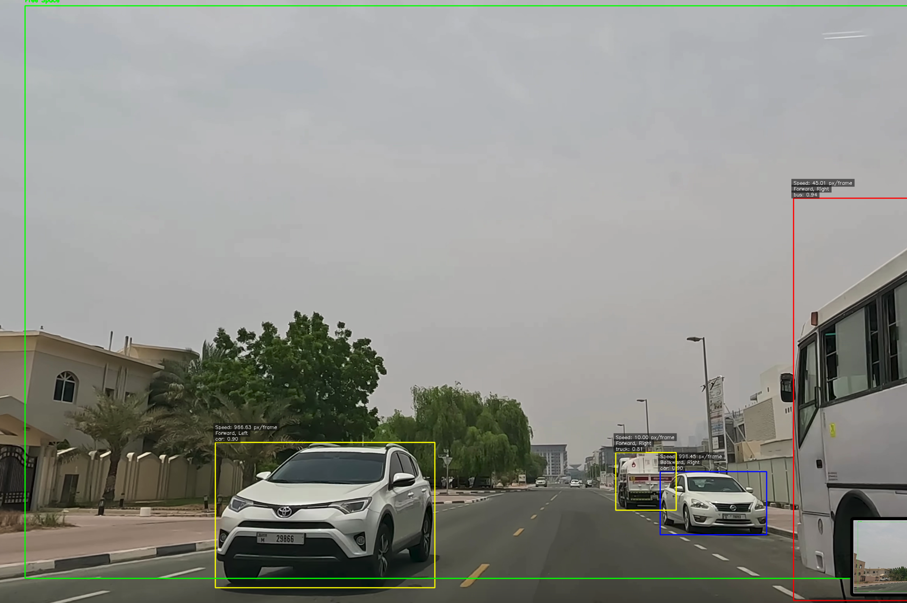
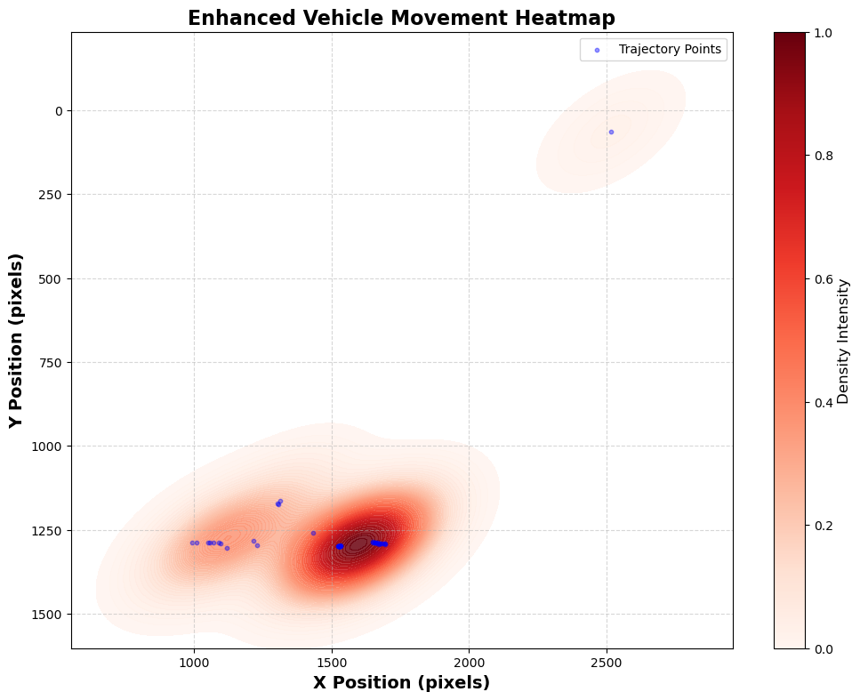

ADAS-PeVision is an AI-powered Advanced Driver Assistance System (ADAS) designed to enhance pedestrian safety by predicting pedestrian movement and potential collision risks using YOLOv8. This system aims to provide real-time alerts to drivers, improving road safety and reducing accidents.

Features
1. Pedestrian Detection: Uses YOLOv8 to detect pedestrians in video frames with bounding boxes.
2. Movement Prediction: Predicts pedestrian movement directions (forward, backward, left, right) using angular difference calculations.
3. Collision Risk Assessment: Computes angular error to estimate potential pedestrian-vehicle collision risks.

Visual Cues:
1. Yellow bounding boxes for pedestrians moving forward.
2. Blue bounding boxes for pedestrians moving backward.
3. Alert System: Triggers an alert if a pedestrian is predicted to be on a collision path with the vehicle.
4. Accuracy Calculation: Measures prediction accuracy based on angular error between actual and predicted pedestrian positions.

Technologies Used
1. YOLOv8 for pedestrian detection
2. OpenCV for image processing
3. Python for implementation

Future Enhancements (NextVision ADAS)
1. Integration of IoT-based sensors for enhanced pedestrian tracking
2. Improved prediction models for better accuracy
3. Real-time alert system via mobile devices

🛠 Installation & Usage
1️⃣ Open Jupyter Lab
Ensure you have Jupyter installed. If not, install it using:

1. pip install jupyterlab

Then, start Jupyter Lab:

2. jupyter lab

2️⃣ Open the Notebook
Navigate to untitled.ipynb in Jupyter Lab.
Open the notebook to view the code and execution steps.

3️⃣ Install Dependencies
Before running the notebook, install the required dependencies:
pip install -r requirements.txt
If a requirements.txt file isn't available, manually install the dependencies:
pip install pygame opencv-python ultralytics numpy

4️⃣ Run the Notebook
Execute all cells in untitled.ipynb.

The Python script will launch, and the system will start detecting and tracking pedestrians.
